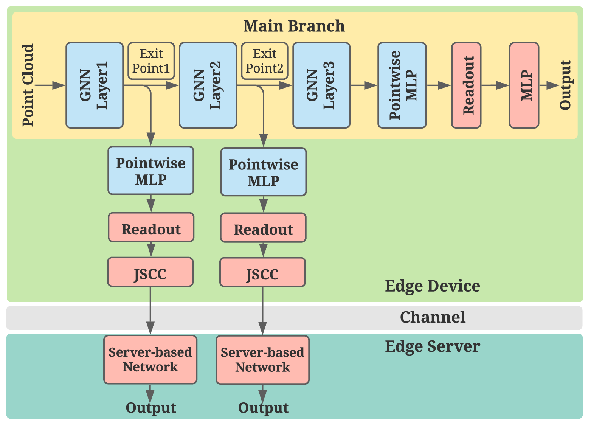

# Branchy-GNN

This code is for the [paper](https://arxiv.org/abs/2011.02422): "Branchy-GNN: a Device-Edge Co-Inference Framework for Efficient Point Cloud Processing", which is submitted to ICASSP2021.


## Framework

We propose a branchy structure for GNN-based point cloud classification to speedup edge inference. We adopt branch structures for early exiting the main branch to reduce the on-device computational cost and introduce joint source-channel coding (JSCC) to reduce the communication overhead.

In the experiment, we have four exit points.

Note that the main branch in the framework is based on [DGCNN](https://github.com/WangYueFt/dgcnn).




### Dependency

```
Pytorch
h5py
sklearn
```


### Dataset

```
ModelNet40
```


### How to run

1. Pretrain a DGCNN model based on the [code](https://github.com/WangYueFt/dgcnn/tree/master/pytorch) or download it from [here](https://github.com/WangYueFt/dgcnn/tree/master/pytorch/pretrained). (``./pretrained/model.1024.t7``)
2. Train the branch network by ``python edge_main.py --num_p=1024 --use_sgd=True --model EXIT1 --channel_noise 0.1``. 

Note that ``--model`` could be ``EXIT1``, ``EXIT2``, ``EXIT3``, and ``EXIT4``.

``--channel_noise`` is the standard deviation in the AWGN channel. The output of the encoder is normalized based on the l-2 norm, and the average signal power is 1.
So, ``channel_noise = 0.1`` means SNR = 20dB.

### Test in different channel conditions
``python edge_main.py --num_points=1024 --k=20  --eval=True --model_path= (saved model path) --channel_noise 0.056``

